# Baja Visión y Contraste

**Proyecto:** EcoRuta Temuco | **Fecha de la Actualización:** 25/09/2026

---

## Herramientas Utilizadas

- **axe DevTools 4.10.3:** Escaneo automático de accesibilidad WCAG 2.1 AA y mejores prácticas.
- **WebAIM Contrast Checker:** Verificación manual de ratios de contraste entre colores específicos del sitio (https://webaim.org/resources/contrastchecker/).
- **Simulador de Deficiencias Visuales (Firefox Nativo):** Simulación de daltonismo (protanopia, deuteranopia, tritanopia, acromatopsia) y pérdida de contraste desde F12 > Accesibilidad.
---

## axe DevTools

### index.html - 3 problemas menores
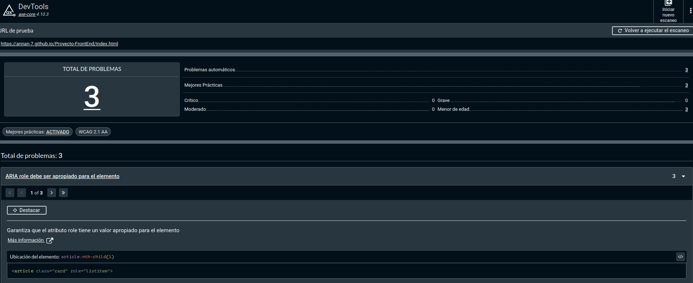
`role="listitem"` en `<article>` sin contenedor `<ul role="list">`.

### rutas.html - 3 problemas graves
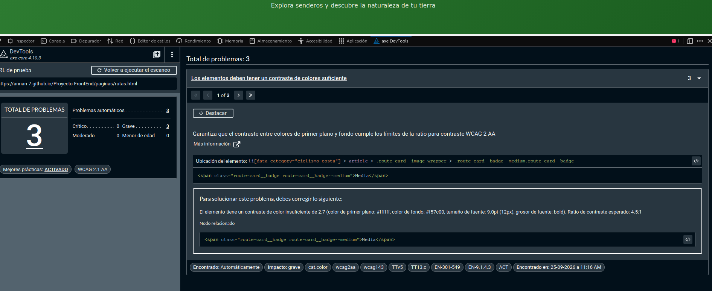
Badge "Media": ratio 2.7:1 (`#ffffff` sobre `#f57c00`, 12px bold). Mínimo requerido: 4.5:1.

### contacto.html - 1 problema moderado
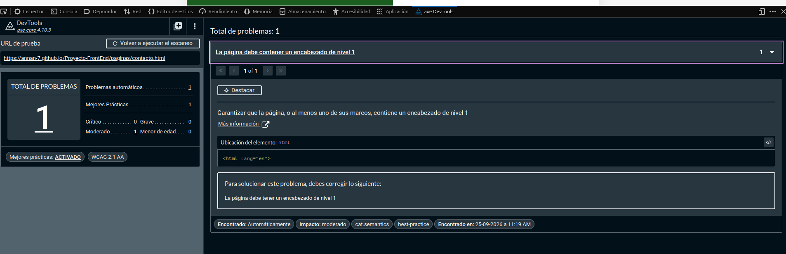
Falta `<h1>` en la página.

### sobre_nosotros.html - 1 problema grave
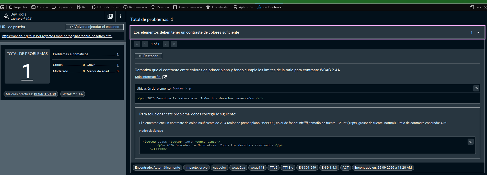
Footer: ratio 2.84:1 (`#999999` sobre `#ffffff`, 16px).

---

## WebAIM Contrast Checker

### Hero/Botones: `#1B5E20` sobre `#FFFFFF`
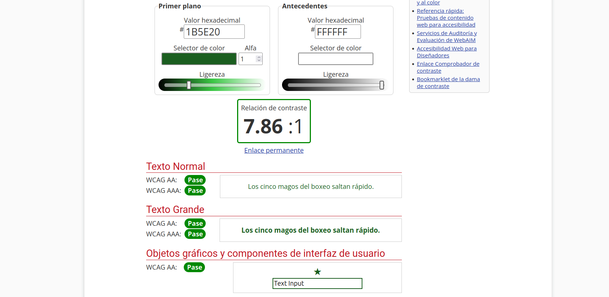
**7.86:1** - Cumple AA y AAA.

### Badges: `#2E7D32` sobre `#EFF1EF`
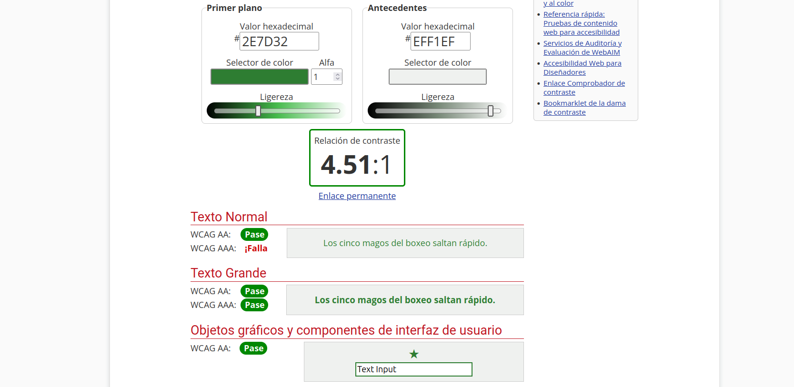
**4.51:1** - Cumple AA (límite), falla AAA. Sugerencia: `#256B28`.

### Cuerpo tarjetas: `#263238` sobre `#ECEFF1`
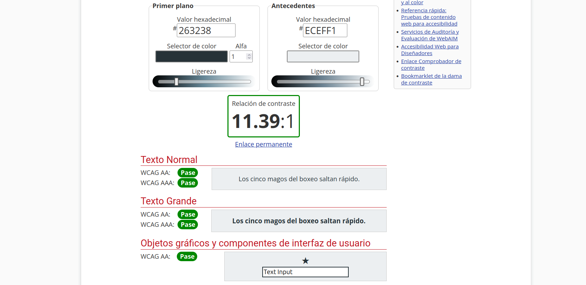
**11.39:1** - Cumple AA y AAA holgadamente.

---

## Simulación Deficiencias Visuales

### Protanopia - index.html
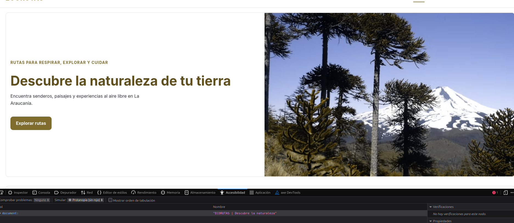
Legible. No depende del rojo.

### Deuteranopia - rutas.html
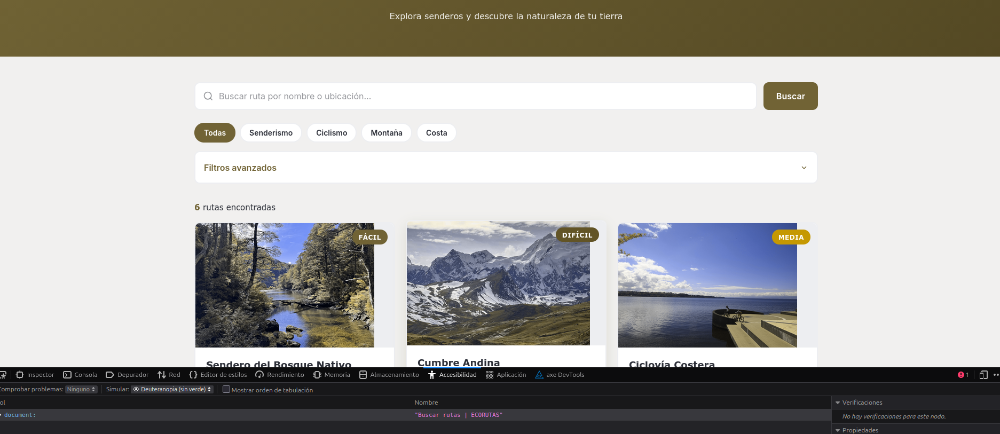
Legible. Badges diferenciables por texto+color.

### Tritanopia - contacto.html
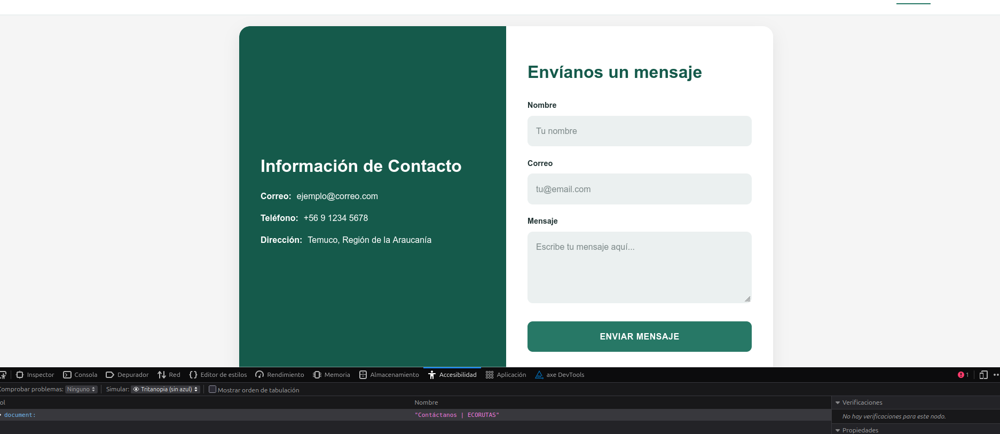
Legible. Formulario usable.

### Acromatopsia - sobre_nosotros.html
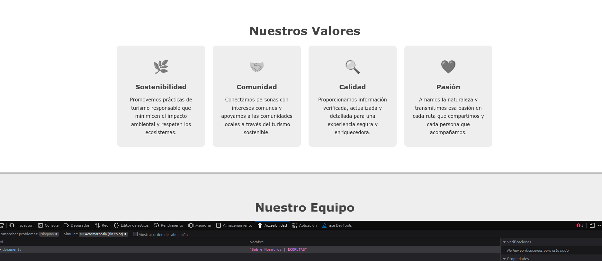
Legible. Iconos distinguibles por forma.

### Pérdida contraste - rutas.html
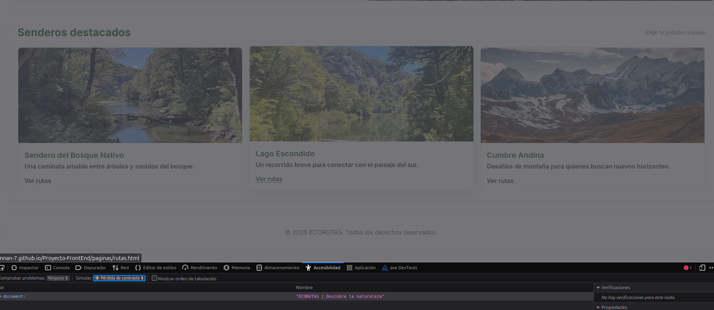
Parcialmente legible. Ligeros problemas de contraste.

---

## Resumen

| Página | axe | WebAIM | Simulación |
|--------|-----|--------|------------|
| index.html | 3 menores (ARIA) | 7.86:1 ✓ | Protanopia ✓ |
| rutas.html | 3 graves (contraste) | 4.51:1 ⚠ | Deuteranopia ✓, Pérdida ⚠ |
| contacto.html | 1 moderado (h1) | - | Tritanopia ✓ |
| sobre_nosotros.html | 1 grave (footer) | 11.39:1 ✓ | Acromatopsia ✓ |

---

## Conclusiones y Recomendaciones

El sitio presenta una base sólida de accesibilidad: no hay problemas críticos, la estructura es navegable con lector de pantalla, las imágenes tienen `alt` descriptivos, y bajo simulación de daltonismo (protanopia, deuteranopia, tritanopia) el sitio mantiene funcionalidad y legibilidad en todas las páginas. Los pares de colores principales (`#1B5E20`/`#FFFFFF` y `#263238`/`#ECEFF1`) cumplen holgadamente con WCAG AAA.

**Problemas a corregir priorizados:**

| Prioridad | Acción | Página |
| :--- | :--- | :--- |
| **Alta** | Cambiar fondo del badge `.route-card__badge--medium` de `#f57c00` a `#e65100` o usar texto negro para alcanzar ratio >= 4.5:1. | `rutas.html` |
| **Alta** | Oscurecer texto del footer de `#999999` a `#666666` o más oscuro. | `sobre_nosotros.html` |
| **Media** | Agregar `<h1>Contáctanos</h1>` en la página. | `contacto.html` |
| **Media** | Oscurecer verde secundario de `#2E7D32` a `#256B28` para ganar margen sobre el límite de 4.5:1. | Global (badges) |
| **Baja** | Envolver cards en `<ul role="list">` o eliminar `role="listitem"` redundante. | `index.html` |

Tras aplicar las correcciones, se debe re-ejecutar axe DevTools y WebAIM para verificar la resolución de los problemas graves antes del cierre del Sprint 1.